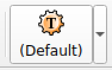
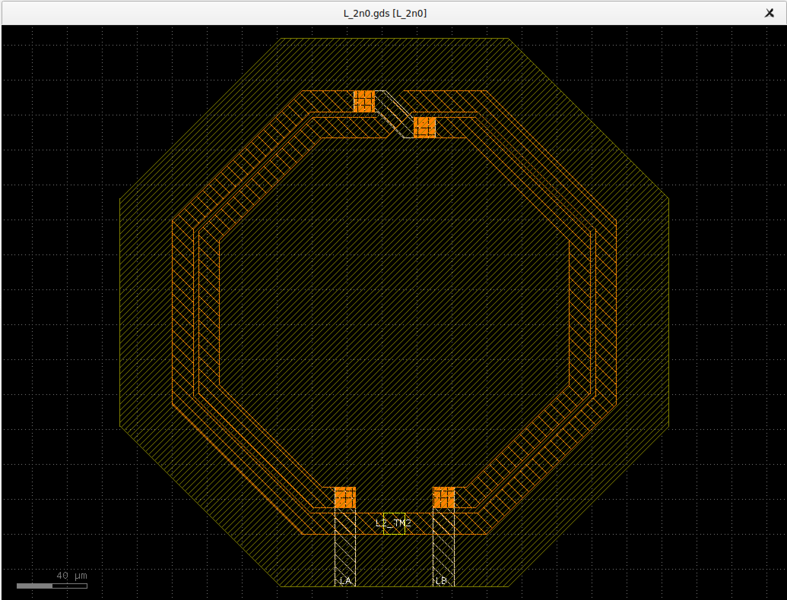

KLayout
=======

Installation
------------

.. tabs::
    .. tab:: Default version (easy)
        On Ubuntu, KLayout is available by default on the repositories, so we just have to install it:

        .. code-block:: shell

            sudo apt install klayout

        .. warning::
            IHP Open PDK needs at least KLayout 29, so you need to make sure you have a recent enough version. Before
            installation, you can check the version you would install with the command ``apt search ^klayout$``. After,
            you can run ``klayout -v``. If the version is not recent enough, you need to use a different way.

    
    .. tab:: Custom version (medium)
        If the default version of your package manager is not recent enough you will have to use a different method.
        Everything is also explained on `KLayout's official website <https://www.klayout.de/build.html>`_. You should
        also check this website to see available versions for your system.
        
        For this example we will download the 29.8. Move to your ``tools_sources`` directory and do:

        .. code-block:: shell

            wget https://www.klayout.org/downloads/Ubuntu-24/klayout_0.29.8-1_amd64.deb
            sudo apt install ./klayout_0.29.8-1_amd64.deb

    .. tab:: Build (hard)
        KLayout website doesn't provide Arm64 packages, therefore you might need to build it yourself. First we need
        to install the dependencies:

         .. code-block:: shell

            sudo apt install ruby ruby-dev python3 python3-dev libz-dev libgit2-dev qtbase5-dev qttools5-dev libqt5xmlpatterns5-dev qtmultimedia5-dev libqt5multimediawidgets5 libqt5svg5-dev

        Go to `https://github.com/KLayout/klayout/releases`_ and download the source code of the version you want to
        build:

        .. code-block:: shell

            git clone https://github.com/KLayout/klayout.git --branch v0.29.8
            cd klayout
        
        Now we can start the compilation:

        .. code-block:: shell

            ./build.sh

        Once the compilation is done, we can add KLayout to our tools:

        .. code-block:: shell

            cp   >> TODO <<

        

PDK installation for Klayout
----------------------------

We will link the PDK's technologies files to klayout directory:

.. code-block:: shell

    mkdir -p  ~/.klayout/tech
    ln -s ~/microelectronics/PDK/IHP/IHP-Open-PDK/ihp-sg13g2/libs.tech/klayout/tech ~/.klayout/tech/ihp-sg13g2

Testing KLayout
^^^^^^^^^^^^^^^

We will now quickly test if KLyaout is working, and that the PDK is well installed. First open klayout:

.. code-block:: shell

    klayout &

Once it is open you should see the technology selector in the upper toolbar:

Click on the arrow and select ``ihp-sg13g2``.

Now we will open a sample GDS, just to see how it looks. We will take one of the inductor used for the OpenEMS example.
For this click on ``File > Open``. Then opened the GDS located at:
``~/microelectronics/PDK/IHP/IHP-Open-PDK/ihp-sg13g2/libs.tech/openems/testcase/SG13_Octagon_L2n0/gds/L_2n0.gds``.

To enable the technology, click on T of the left part of technology selector. You should see the layers color and the
names in the right "Layers" panel have changed.

To only show the used layers, right clik in the "Layers" pane and select "Hide Empty Layers". Then to properly select
unwanted layers, for this left clik on the "NoRCX" layer then maintain the ``Shift`` key while clicking on the
"GraphBot" layer. Now right click on one of the 9 selected layers and click on "Hide". Now you should see something like
this :

