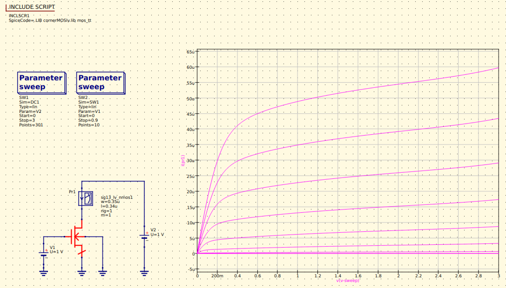

QUCS
====

To create and design our schematic circuit, the Quite Universal Circuit Simulator (QUCS) will be used. Also, for this
project, the usage of free circuit simulation kernels is adviced. Thus, we will use the Qucs-S extension with Ngspice 
and Xyce as simulation kernels. 

In addition to this section, you can visit `Qucs-S GitHub <https://github.com/ra3xdh/qucs_s>`_ for more information.

Installation
------------

From repositories
^^^^^^^^^^^^^^^^^

The best way to get and maintain Qucs-S on Ubuntu is with the ``apt`` package manager. But Qucs-S is not directly on the
default Ubuntu's repositories, therefore we need to follow the procedure recommended by the tool's author. We describe
the procedure for Ubuntu 24.04 below, but you can also find it for other operating systems and version on `this website
<https://software.opensuse.org/download.html?project=home%3Ara3xdh&package=qucs-s>`_.

.. code-block:: shell

    echo 'deb http://download.opensuse.org/repositories/home:/ra3xdh/xUbuntu_24.04/ /' | sudo tee /etc/apt/sources.list.d/home:ra3xdh.list
    curl -fsSL https://download.opensuse.org/repositories/home:ra3xdh/xUbuntu_24.04/Release.key | gpg --dearmor | sudo tee /etc/apt/trusted.gpg.d/home_ra3xdh.gpg > /dev/null
    sudo apt update
    sudo apt install qucs-s

From sources
^^^^^^^^^^^^

Another way to get Qucs-S is by building it from source. You can skip this part if you already installed the tool from
repositories.

Dependencies
""""""""""""

First, we need to make sure we have all the dependencies:

.. code-block:: shell

    sudo apt install ngspice cmake flex bison gperf dos2unix build-essential qt6-base-dev qt6-tools-dev qt6-tools-dev-tools libglx-dev linguist-qt6 qt6-l10n-tools libqt6svg6-dev libqt6-charts6-dev libgl1-mesa-dev

Getting the sources
"""""""""""""""""""

Now we can get the sources from GitHub, go at the address `<https://github.com/ra3xdh/qucs_s/releases>`_ and download
the file ``.tar.gz`` file corresponding to the version you want to install. Here we will use the version ``24.4.1``.
Move the downloaded file to your the ``tools_sources`` directory to keep things clean.

Builing and installing Qucs-S
"""""""""""""""""""""""""""""

First unarchive the sources and create a temporary build directory:

.. code-block:: shell

    tar xvfz qucs-s-24.4.1.tar.gz
    cd qucs-s-24.4.1
    mkdir builddir
    cd builddir

Then we prepare our build to install in the right folder. Adapt the ``CMAKE_INSTALL_PREFIX`` parameter to your file
organisation.

.. code-block:: shell

    mkdir ../../../tools/qucs-s
    cmake ..  -DCMAKE_INSTALL_PREFIX=../../../tools/qucs-s -DWITH_QT6=ON

After that we can build Qucs-S (This step might take some time):

.. code-block:: shell

    make

And finally install it and adding to path:

.. code-block:: shell

    make install
    echo 'export PATH="$PATH:$HOME/microelectronics/tools/qucs-s/bin"' >> ~/.bashrc

Now that Qucs-S is installed, you can delete the build files in ``tools_sources``. Go in that folder then (adapt with
your version of Qucs-S):

.. code-block:: shell

    rm -rf qucs-s-24.4.1/ qucs-s-24.4.1.tar.gz

Testing Qucs-S
""""""""""""""

You can try if Qucs-S works, just by running the command:

.. code-block:: shell

    qucs-s

The next step is to implement the IHP PDK into Qucs-S, so if you opened it, you can close it for now and continue.

PDK installation for Qucs-S
---------------------------

.. TODO: Move OpenVAF and ngspice compilation to a didacated and optional page

Getting OpenVAF
^^^^^^^^^^^^^^^

IHP Open PDK's uses compiled Verilog-A models, thus we need to compile the models. For that, IHP uses the OpenVAF tool.
OpenVAF is not available on package managers, therefore we wether have to download it, or to build it from source.

If you can, it is recommended to download it from `OpenVAF download page <https://openvaf.semimod.de/download/>`_.

Otherwise, here is the building instruction:

Getting dependencies
""""""""""""""""""""
OpenVAF compilation requires Clang, LLVM, LD and Cargo. It is important to use the same version of Clang and LLVM.
With Ubuntu 24.04 we will get ``clang-18`` and ``llvm-18``.

.. code-block:: shell

    sudo apt install clang clang-tools llvm lld cargo

By default, the package manager might not link the right binary to the right command, and OpenVAF won't build.
For instance, the command ``clang-cl`` doesn't exist, but ``clang-cl-18`` does. So we need to create a link:

.. code-block:: shell
    
    sudo update-alternatives  --install  /usr/bin/clang-cl  clang-cl  /usr/bin/clang-cl-18  1

We need a recent version of rustc, to ensure this run:

.. code-block:: shell
    
    rustc --version

If the printed version is older 1.80, download a more recent version:

.. code-block:: shell

    sudo apt install rustc-1.80 cargo-1.80

Getting the sources
"""""""""""""""""""
Go in your ``tools_sources`` directory, to clone OpenVAF's sources.

Sadly `OpenVAF <https://github.com/pascalkuthe/OpenVAF>`_ stopped being officially maintained a year  ago. And it is not
compatible anymore with recent LLVM/Clang versions. So we will need to use a fork compatible with LLVM 18. However, if
you are using LLVM 15 or 16, you can probably stick the original version.

.. code-block:: shell

    git clone https://github.com/Kreijstal/OpenVAF
    cd OpenVAF
    git switch llvm18reloaded

The ``git switch`` command allows us to use a different branch from the git repository.

OpenVAF compilation
"""""""""""""""""""

Warning: If you installed a particular version of ``rustc`` you will have to use the command ``cargo-1.80`` instead of
just ``cargo``.

Now we can start the compilation:

.. code-block:: shell

    cargo build

Install OpenVAF
"""""""""""""""

We can copy the compiled binary and move it to our tools directory:

.. code-block:: shell

    mv target/debug/openvaf ~/microelectronics/tools/
    echo 'export PATH="$PATH:$HOME/microelectronics/tools/"' >> ~/.bashrc

Now that OpenVAF is installed, you can delete the build files in ``tools_sources``. Go in that folder then:

.. code-block:: shell

    rm -rf OpenVAF

Linking PDK to Qucs-S
^^^^^^^^^^^^^^^^^^^^^
Run the following commands : 

.. code-block:: shell

    cd ~/microelectronics/PDK/IHP/IHP-Open-PDK/ihp-sg13g2/libs.tech/qucs
    export PDK_ROOT="$HOME/microelectronics/PDK/IHP/IHP-Open-PDK"
    python3 install.py

Testing with IHP Example
------------------------

We will now test if Qucs-S works with the PDK. First we need to setup the environment variable:

.. code-block:: shell

    echo 'export PDK_ROOT="$HOME/microelectronics/PDK/IHP/IHP-Open-PDK"' >> ~/.bashrc
    echo 'PDK="ihp-sg13g2"' >> ~/.bashrc
    export PDK_ROOT="$HOME/microelectronics/PDK/IHP/IHP-Open-PDK"
    export PDK="ihp-sg13g2"

Then we can run Qucs-s:

.. code-block:: shell

    qucs-s

Before running any simulation, we need to add the IHP library to Qucs-S. For this, on Qucs-S go in ``File > Application
Settings...``, then open the ``Location`` tab and click on the ``Add Path With SubFolders`` button.
In the oppened window, go in your home folder (``/home/<your_name>``), then right click in the white zone to enable 
"Show hidden files". Then you should be able to see ``.qucs`` folder, open it and select ``user_lib``.

Now we will open an example, go in ``File > Open...``. In the opened window, go in your home folder then ``QucsWorkspace
> IHP-Open-PDK-SG13G2-Examples_prj > dc_lv_nmos.sch``. This will open a simple schematic with a Nmos.

.. |simulate_symbol| image:: ../images/simulate.png
    :height: 24px

To run the simulation you just have to click on the |simulate_symbol| icon. When the simulation is finished, you should
see somthing like that:

Install ngspice-44
^^^^^^^^^^^^^^^^^^

From verison 44, ngspice is compatible with OSDI v0.4, so it might be interesting to use it. However it is not yet
available on package managers, so we have to build it.

Getting dependencies
""""""""""""""""""""

.. code-block:: shell

    sudo apt install autoconf libtool automake libxaw7-dev libreadline-dev

Downloading the sources
"""""""""""""""""""""""

.. code-block:: shell

    git clone https://github.com/imr/ngspice
    cd ngspice
    git switch pre-master-44

Compiling
"""""""""

.. code-block:: shell

    ./autogen.sh
    mkdir release
    cd release
    ../configure --with-x --enable-cider --enable-predictor 
    make 2>&1 | tee make.log
    sudo make install
