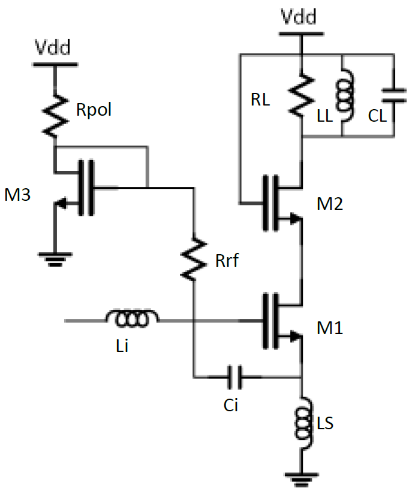

First steps
===========

Context & specifications
------------------------

To keep a simplified approach, we will design a single ended cascode RF low noise amplifier.
This will allow us to describe each step of the design flow and use most features of the softwares.

|

For this tutorial, we will desgin the LNA based on the following specifications :

Gv = 20 (26 dB)
IIP3 = -10 dBm
f0 = 2.45 GHz
Cl = 1 pF ; Qe = 2
Vdd = 3.3 V ; Idmax = 1.5 mA

..
  TODO
  How to formulate this ?
  Ll = 4.22 nH for Cl = 1pF
  gmM1 = 12.8 mS 
  Rl = 781.25 Ohms for Gv = 20
  Ci = 587.2 fF for Qe = 2
  //Ls = 2.5 nH ; Vod = Vdsat = 234 mV pour Id = 1.5 mA

Process variables
-----------------

The IHP PDK provides process control parameters for their components.
The parameters can be found on the file SG13G2_os_process_spec.pdf
in IHP-Open-PDK ▸ ihp-sg13g2 ▸ libs.doc ▸ doc.

Here, we retrieve NMOS parameters that will be useful for our design : 

..
  TODO
  Add math integration here. Change format also

Lmin = 0.12um
Cox = epsilon/tox = 14.35 fF.um-2
tox = 2.45 nm & epsilonr = 3.97
Cjunc = 0.95 fF.um-2